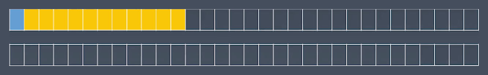
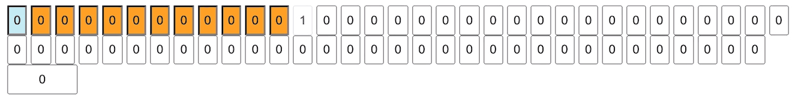

<!--
 * @Author: cocoon
 * @Date: 2020-10-01 13:28:01
 * @LastEditTime: 2020-10-06 17:09:31
 * @LastEditors: Please set LastEditors
 * @Description: In User Settings Edit
 * @FilePath: /Frontend-02-Template/week02/NOTE.md
-->

# 前端训练营-week02 丨 重学JavaScript

## 预习内容

第 2、3 周预习知识点：

- [JavaScript 类型：关于类型，有哪些你不知道的细节？](https://time.geekbang.org/column/article/78884 "JavaScript 类型：关于类型，有哪些你不知道的细节？")
- [JavaScript 对象：面向对象还是基于对象？](https://time.geekbang.org/column/article/79319 "JavaScript 对象：面向对象还是基于对象？")
- [JavaScript 对象：我们真的需要模拟类吗？](https://time.geekbang.org/column/article/79539 "JavaScript 对象：我们真的需要模拟类吗？")
- [JavaScript 对象：你知道全部的对象分类吗？](https://time.geekbang.org/column/Article/80011 "JavaScript 对象：你知道全部的对象分类吗？")
- [JavaScript 执行（一）：Promise 里的代码为什么比 setTimeout 先执行？](https://time.geekbang.org/column/article/82764 "JavaScript 执行（一）：Promise 里的代码为什么比 setTimeout 先执行？")
- [JavaScript 执行（二）：闭包和执行上下文到底是怎么回事？](https://time.geekbang.org/column/article/83302 "JavaScript 执行（二）：闭包和执行上下文到底是怎么回事？")
- [JavaScript 执行（三）：你知道现在有多少种函数吗？](https://time.geekbang.org/column/article/83719 "JavaScript 执行（三）：你知道现在有多少种函数吗？")
- [JavaScript 执行（四）：try 里面放 return，finally 还会执行吗？](https://time.geekbang.org/column/article/83860 "JavaScript 执行（四）：try 里面放 return，finally 还会执行吗？")
- [JavaScript 词法：为什么 12.toString 会报错？](https://time.geekbang.org/column/article/86400 "JavaScript 词法：为什么 12.toString 会报错？")
- [（小实验）理解编译原理：一个四则运算的解释器](https://time.geekbang.org/column/article/86823 "（小实验）理解编译原理：一个四则运算的解释器")
- [JavaScript 语法（预备篇）：到底要不要写分号呢？](https://time.geekbang.org/column/article/87179 "JavaScript 语法（预备篇）：到底要不要写分号呢？")
- [JavaScript 语法（一）：在 script 标签写 export 为什么会抛错？](https://time.geekbang.org/column/article/87808 "JavaScript 语法（一）：在 script 标签写 export 为什么会抛错？")
- [JavaScript 语法（二）：你知道哪些 JavaScript 语句？](https://time.geekbang.org/column/article/88538 "JavaScript 语法（二）：你知道哪些 JavaScript 语句？")
- [JavaScript 语法（三）：什么是表达式语句？](https://time.geekbang.org/column/article/88827 "JavaScript 语法（三）：什么是表达式语句？")
- [JavaScript 语法（四）：新加入的 ** 运算符，哪里有些不一样呢？](https://time.geekbang.org/column/article/89151 "JavaScript 语法（四）：新加入的 ** 运算符，哪里有些不一样呢？")

## 课件

### 录播 | 一、 JS语言通识 | 泛用语言分类方法

#### 1. 语言按语法分类

- 非形式语言
  语法比较自由，没有严格定义
  - 中文
  - 英文等
  
- 形式语言
  具有形式化定义的特点，严谨严格。而在形式语言中还有进一步的分类，下列介绍的分类为乔姆斯基谱系。4种文法是一种上下包含的关系。比如：1型一定属于0型，但是0型不一定属于1型。
  
  - 0型 无限制文法
    定义语言是什么样就是什么样
  - 1型 上下文相关文法
    同样的词句的组合是跟上下文内容相关的
  - 2型 上下文无关文法
    同样一个表达，不管放在哪里，都是一样的意思
  - 3型 正则文法
    能够被正则表达式去描述的一种文法

  产生式这一工具可以让大家能够严格地去描述乔姆斯基谱系里面的各种文法。

### 录播 | 二、 JS语言通识 | 什么是产生式

#### 1. 产生式（BNF）

产生式：巴科斯-诺尔范式 (BNF)

实际上产生式有多种。不同文档会选用不同的产生式的方式，但是他们的大体结构和表达的能力相近​。巴科斯-诺尔范式，属于其中最经典也是最常用的一种描述方法。

- < > 用尖括号括起来的名称来表示语法结构名，如中文里有主谓宾，编程语言里的if语句、函数都是类似的描述它的语法语句
- 语法结构分成基础结构和需要用其他语法结构定义的复合结构
  - 基础结构称终结符（Terminal Symbol）
  - 复合结构称非终结符（Nonterminal Symbol）
  语言里一定有很多终结符，然后由这些终结符形成一定语法结构，来产生一些非终结符。一般我们语言中都有一个最上层的非终结符来代表整个语言的文体。

- " " 引号和中间的字符表示终结符，即用字符串来表示终结符
- （）可以有括号，以此产生不同的结构。用括号括起来变成一组
- \* 表示可以重复多次
- | 表示或，竖线两边的是可选内容
- \+ 表示至少一次

比如说要做一个字母a的列表，则就会把字母a用双引号引起来，而列表如果说这个列表里的a至少要出现一次，那么则会在a后面加上一个加号 `a+`。而如果想做一个a或者b字母的列表则会写 `a|b`然后外面阔起来再加上加号 `(a|b)+`。这就是我们产生式的一个基本写法。  

实例  定义四则运算：  

``` html
<MultiplicativeExpression>::=<Number>|
        <MultiplicativeExpression>"*"<Number>|
        <MultiplicativeExpression>"/"<Number>|
<AddtiveExpression>::=<Number>|
        <AddtiveExpression>"+"<MultiplicativeExpression>|
        <AddtiveExpression>"-"<MultiplicativeExpression>|
```

1 + 2 * 3

由左边的 1 加上 右边 2 \* 3 的结果组成的语法结构，2 \* 3 是一个子结构，而 2 \* 3 中包含左右的 numbner 和 运算符 * 。

- 终结符：
  - Number
  - \+ - * /
- 非终结符：
  - MultiplicativeExpression （乘法的结构）
  - AddtiveExpression （加法的结构）

常用BMF使用技巧：
将特殊的number定义为一个乘法结构，此时定义加法的时候可以认为左右都是一个乘法结构

>先定义一个加法表达式，让它等于一个乘法表达式的列表。那么这个BNF的定义是可以递归的，则可定义它要么是一个单独的乘法表达式，要么是一个加法表达式加上或者减去一个乘法的表达式。这样就能得到一个这样的加法的定义。乘法的表达式也类似,只不过是我们把乘法表达式的位置换成Number就可以了。这里面我们可以发现所有的终结符就包括 Number、加、减、乘、除 这些都属于终结符。而非终结符就是 MultiplicativeExpressio 和 AddtiveExpression 。注意到这里有把一个单独的 Number 也定义为了一种特殊的乘法的结构，这样就可以在定义加法的时候比较简单。即可以认为这个左右都是一个乘法结构。这是一个比较常用的使用BNF的小技巧。这样就描述出来了四则运算。  

- [（小实验）理解编译原理：一个四则运算的解释器](https://time.geekbang.org/column/article/86823 "（小实验）理解编译原理：一个四则运算的解释器")

### 录播 | 三、 JS语言通识 | 深入理解产生式

#### 1. 通过产生式理解乔姆斯基谱系

- 0型 无限制文法  
  - `?::=?`
  一个短短的 A 就可以产生10个不同的非终结符，然后由他们再组成一些复杂的这样的语法结构。所以无限制文法中可以随便写，定义的左边和右边，写什么都可以
  
- 1型 上下文相关文法
  - `?<A>?::=?<B>?`
  虽然可以左右两边都写多个非终结符。但是会发现虽然可以写多个，但变的只能是有一个。那么左边变化的只能有一个，而变的部分一定是有一个前面和后面，这样的一个关系，一定是有一个固定不变的部分。即前面蓝色问号 `？` 开头的部分和后面橙色问号 `？` 结束的部分。即蓝色问号的部分叫做上文，橙色问号的部分就叫做下文。所以上下文相关文法它就是一个根据前后来判别每一个符号，它所表达的意义的这样一种文法

- 2型 上下文无关文法
  - `<A>::=?`
  左边只能有一个非终结符，而右边可以随便写。可以是一大堆终结符，也可以是终结符和非终结符的混合。
- 3型 正则文法
  - `<A>:=<A>?`
  - `<A>:=?<A>` ❌
  正则文法假如是递归定义的。那么它不允许你这个定义A出现在尾巴上。比如说左边是一个符号A，那么右边A一定是出现在产生式的最开头。一定不能出现在结尾。根据这个规则，所有的正则文法都是可以用正则表达式来表示的。  
  
>提问：JavaScript是上下文相关文法还是上下文无关文法，以及JavaScript是否是正则文法？

JavaScript虽然总体上属于上下文无关文法，其中的表达式部分大部分属于正则文法。但还有两个特例 ——

``` JavaScript
2 ** 1 ** 2
```

JavaScript表达式里有新加了一个星星运算符 `**` ，表示乘方。乘方运算符其实它就是一个右结合的。所以`2 ** 1 ** 2` 的答案是2。`1**2` 先运算，1的平方仍然是1，2的1次方是2。因为它是右结合的所以不是正则文法，如果再加上if之类语句，就更不是正则文法了。

- [JavaScript 语法（四）：新加入的 ** 运算符，哪里有些不一样呢？](https://time.geekbang.org/column/article/89151 "JavaScript 语法（四）：新加入的 ** 运算符，哪里有些不一样呢？")

``` JavaScript
{
  get a {return 1}
  get: 1
}
```

JavaScript也不是一个严格意义上的上下文无关文法。特例比如get，可以理解为类似于关键字，在定义对象的时候，如果在get后面写a，和get后面不写a，它表示的意思是不一样的。写a时它是类似关键字的东西，如果在get后面直接冒号则它自己是属性名。所以这里如果严格按照乔姆斯基谱系来理解，JavaScript其实它属于上下文相关文法。乔姆斯基谱系是一个非常学术的定义方式，在JavaScript引擎的实现上可以理解它总体的编程的结构都是一个针对上下文无关文法的这样的一个分析。而一旦遇到get这样上下文相关文法的地方，那么就会单独用代码做一些特例处理。所以一般来说也不会把JavaScript归结为上下文相关文法去处理，只要有一个特例就会把它变成一个更泛的特例。这就是如何从产生式的角度去理解乔姆斯基谱系。

#### 2. 其他产生式

除了乔姆斯基谱系可以用BNF来定义，其实还有很多不同的产生式的类型。比如后来出现的EBNF、ABNF都是针对BNF做了一些语法上的扩展。不过其实最常见的，一般来说还是每个语言的标准里面都会自己定义一个产生式的书写方法。

``` javascript产生式
AddtiveExpression:
    MultiplicativeExpression
    AddtiveExpression +
MultiplicativeExpression
    AddtiveExpression -
MultiplicativeExpression
```

比如以上就是JavaScript标准里面书写产生式的例子。它开头是缩进来表示的，它的开头相当于产生式左边的非终结符。非终结符后面跟了一个冒号`:`，而之后给了两格缩进。JavaScript产生式的书写方式，它非终结符加号减号是用加粗的黑体字来表示它是终结符的。所以网络上可以看到的产生式五花八门，只学一个BNF是没有办法读懂所有的语言的。但尽管它们有不同的书写方法，但它们所表达的意思都是一样的。理解了产生式背后的思路和原理就可以忽略这种表达方式上的区别。

### 录播 | 四、 JS语言通识 | 现代语言的分类

#### 1. 现代语言的特例

在现代的编程语言里，除了之前提到的JavaScript的特例，其他的一些语言其实也并不是非常严格去贴合着乔姆斯基谱系里面的各个模型去设计的。

- C++中，* 可能表示乘号或者指针，具体是哪个，取决于星号前面的标识符是否被声明为类型
- VB中，< 可能是小于号，也可能是XML直接量的开始，取决于当前位置是否可以接受XML直接量
- Python中，行首的tab符和空格会根据上一行的行首空白以一定规则被处理成虚拟终结符indent或者dedent
- JavaScript中，/ 可能是除号，也可能是正则表达式开头，处理方式类似于VB，字符串模板中也需要特殊处理 }，还有自动插入分号规则

上述例子都不是形式化定义里可以涵盖的，会发现大部分主流的流行的语言里面，它其实都有一些边边角角的地方为了让使用者方便，而导致编程的时候更加的困难。

#### 2. 语言的分类

除了乔姆斯基谱系的这种根据文法的复杂程度的分类，还可以按照其他方式进行分类——

- 形式语言-用途
  - 数据描述语言：本身无法进行编程的语言
  JSON、HTML、XAML、SQL、CSS
  - 编程语言
  C++、C、Java、C#、Python、Ruby、Perl、Lisp、T-SQL、Clojure、Haskel、JavaScript

- 形式语言-表达方式

  - 声明式语言：只告诉你他的结果是怎么样的
    JSON 、HTML、XAML、SQL、CSS 、Lisp、Clojure、Haskel

  - 命令型语言： 会告诉你达成这个结果每个步骤会是怎么样的
  C++、C、Java、C#、Python、Ruby、Perl、T-SQL、JavaScript

### 录播 | 五、 JS语言通识 | 编程语言的性质

#### 1. 图灵完备性

所有编程语言必备的一个条件就是图灵完备性，最早其由图灵在研究数学上面的可计算性的时候提出的概念。图灵完备性有几个不同的表达方式。比如跟图灵机完全等效的就是图灵完备。更直观表述就是，所有的可计算的问题，都可用来描述的这样的语言就是具备图灵完备性的。  

在经过了一代代计算机语言的发展以后，图灵完备性逐渐地收敛到了几个固定的模式。所有的命令式语言基本上它是从图灵机理论来的图灵完备性。所以它实现图灵完备性的方式要么是使用goto语句，要么是使用if加while语句。经过一些数学家的证明，这两个模式都可以实现完整的图灵完备性。而在声明式语言它来自于另一个数学家的成果，由邱奇提出的Lambda演算。可以理解为它是数学上定义的一种Lambda函数。它和我们今天的函数是比较相似的，但它的基本意思就是一种替换的关系。Lambda演算它可以通过递归来实现图灵完备。
所以在可计算性上计算机语言也是有两个流派。这两个方式在很多现代语言里基本是两者都支持，所以在使用的时候可以经常去判断它们适用的场景，选择合适的方式来实现它们。

- 命令式——图灵机
  - goto
  - if和while
- 声明式——lambda
  - 递归

#### 2. 动态与静态

- 动态：它一定是在用户的设备或者是在线的服务器上面运行的，它运行的时机就是在产品实际的应用运行时。Runtime就是运行时
  - 在用户的设备/在线服务器上
  - 产品实际运行时
  - Runtime

- 静态：它最显著的一个特征就是在程序员的设备上运行的，而它的时机则是在产品开发时。静态对应的属于是Compiletime即编译时。像js这种解释执行的语言其实没有真正的Compiletime，现在有的也会用Webpack去build一下。对于JavaScript也还是会用Compiletime来讲述它里面的一些特性
  - 在程序员的设备上
  - 产品开发时
  - Compiletime

#### 3. 类型系统

- 动态类型系统与静态类型系统
  - 动态类型：即可以在用户的机器或内存里面能够找到的类型
    - JavaScript就是典型的动态类型系统，可以在写代码时把这个类型当字符串去取出来
  - 静态类型：只在程序员编写代码的时候能够保留的类型信息
    - 典型的静态类型系统像C++，他其实最终编译到目标的机器的代码的时候所有的类型信息都已经被丢掉了。

所以区分动态静态类型最简单的方法就是区分它在谁的电脑上能够保留下来。由于Java一类语言它由于提供了反射机制，所以算是一种半动态半静态的类型系统。就是在编译时主要的类型检查和类型的操作都已经在编译时被处理掉了，但是如果想在运行时去获得这个类型的一些信息也还是可以通过反射去获取的。这就是一些比较新的语言会采取的一些方式。
  
- 强类型与弱类型
  - String + Number
  - String == Boolean

强类型和弱类型在很多时候常常和动态与静态去混淆。其实强类型和弱类型它只是说明在编程语言里类型转换发生的形式。强类型语言的类型转化是不会默认发生的。JavaScript是一个典型的弱类型的语言。比如说用String和Number相加，会默认的把Number转换成String类型，从而最后让你得到一个String。而像双等号这种，它在String和Boolean之间去做双等运算的话，会先把String转成Number，然后再把String和Boolean去做是否相同的对比。
  
- 复合类型
  - 结构体
  - 函数签名

``` Javascript
{
  a:T1
  b:T2
}

(T1,T2) => T3
```

类型往往会产生一些复合类型。比如可以定义一个结构体、定义一个对象，那么它的a属性它必须的属于类型T1，我们有一些函数，像JavaScript语言的函数是可以作为参数传递的，所以函数也有类型。这个我们一般把它称作函数签名。函数签名里包含参数类型和返回值类型两个部分。参数类型它又是一个列表，所以说函数类型它可能就会有T1、T2 变成 T3 这样的一种形式。

- 子类型

像C++ 语言会有子类型的概念。当然，所有基于类的面向对象的语言它都会把类的结构关系变成类型的关系。注意类和类型其实是两个概念，那么有了子类型的概念，所以说在做类型转换的时候它就会有一些默认的行为。比如说能用父类型的地方，它都能用子类型。

- 泛型
  - 协变/逆变

有一些语言里面现在又多了一种范式，叫做范型编程，还可以把这个类型当作一个参数一样的东西去传递给我们的某一段代码结构。这个代码结构有可能是类，有可能是函数，分别对应着泛型类和泛型函数。泛型和子类型相结合就会产生逆变、协变这样的东西。

``` html
凡是能用Array<Parent>的地方，都能用Array<Child>
凡是能用Function<Child>的地方，都能用Function<Parent>
```

比如说Array是一个接受泛型的数组，那么凡是能用到它的Parent的地方，它都能用到它的Child。都能用Child的类型的数组去替代，也不管我们要对Array里面的元素做什么操作，它都可以。Child类型肯定继承了Parent类型所有的功能。这就是协变。
如果说泛型的结构它是一个Function，它接受Child作为参数，也一定能够去接受Parent作为参数。这样的函数，就可以把能够接受Parent参数的函数传进去。然后让它代替能够接受Child的函数。这种就称为逆变。

>所以说泛型与不同的类型系统相结合，就会形成一个非常复杂的一个类型的机制。其实在类型论里面，类型推导和像逆变、协变加上子类型、复合类型这些的结构上面一直是有一些未解的难题的。

### 录播 | 六、 JS语言通识 | 一般命令式编程语言

#### 1. 一般命令式编程语言

- Atom
  - Identifier
  - Literal

一般来说我们的命令式语言它可能有一些细微的结构上的不一致，但是它总体来讲它的结构会分成5个层级。第一个层级就是原子级，原子级是一个语言的最小的组成单位，它通常包含着一些关键字，包含着一些直接量，包含着一些变量名这样的一些基本的单位。这种基本的单位我们把它称为原子。典型的就是变量名、1234这种字符串直接量和数字直接量。

- Expression
  - Atom
  - Operator
  - Punctuator

接下来是表达式，这些原子级的结构通过运算符相连接，然后再加上一些辅助的符号，那么他就会构成一个表达式的结构。表达式它通常是一个可以级联的结构。在前面讲产生式的时候也有以四则运算为例让大家简单了解了一下表达式的这种形态。复杂的语言可能有10多层的表达式。比如JavaScript除了四则运算，还有按位与、移位运算、比较运算、或、非 一些逻辑运算，有一个非常复杂的这样的结构。

- Statement
  - Expression
  - Keyword
  - Punctuator

表达式加上一些特定的标识符、特定的关键字和一些特定的符号形成一定的结构我们称之为语句。if条件语句、while、for循环语句，它在这个里面都会在它的不同的部分用到表达式

- Structure
  - Function
  - Class
  - Process
  - Namespace
  - ……

一个有语句的语言其实已经是一个可以达到图灵完备并且去执行的语言。而语言一般在上面还有两个层级。一个叫做结构化的层级，比如在JavaScript里面就会有Function、Class这样的一些设计，它是帮助我们去组织代码，把代码分成不同的块然后分成不同的复用的结构。同样他也是会使用像关键字来形成这种结构化的结构。JavaScript里面没有的可能像Proces，所谓的过程。还有一些语言比如C++里会有Namespace

- Program
  - Program
  - Module
  - Package
  - Library

更上一层级通常是用来组织代码的。有的语言有，有的不再语言里面在一些辅助性的设施里面。Program、Module、Package、Library这些概念能够帮助我们去更好地管理语言地模块和安装。在JavaScript里面我们现在通常做这一个角色的是npm。JavaScript本身也有两个最顶级的定义。一个叫Program，一个叫Module。Module就是准备好被复用的模块，Program就是实际执行的代码。两者之间在JavaScript里面做了严格的区分，也有一些语言里根本就不区分这两个。

#### 2. 重学Javascript


>我们对每个层级的讲解方式都会有一个比较固定的结构。对于每个层级来说我们都是以语法作为线索，但是除了语法，我们重点讲的是语义和运行时。我们通过某一些语法一定的语义，最后改变了运行时的状态。

### 录播 | 七、 JS类型 | Number

JavaScript最小的结构是什么呢。下面会从JavaScript最小的单位字面值和运行时的类型开始

#### 1. Atom

- Grammar 底层语法元素
  - Literal
  - Variable
  - Keywords
  - Whitespace
  - Line Terminator

以上都是组成JavaScript语言的最小元素。这是通过我们的字面值，比如说我们表示一个数字类型的字面值然后再配合我们的变量，配合我们的一些if else 关键字和一些符号，另外我们还有空白符/换行符，它们虽然不会产生实际的语言作用，但它们可以让整个语言的格式更好看。

- Runtime 运行时
  - Types
  - Execution Context

而这些东西实际最终反映到运行时，字面值的重点在它的类型。有五六种字面值的写法，对应到了JavaScript的7种类型中的几种。另外我们的变量实际上是对应到运行时的Execution Context里面的一些存储的变化。最终这些语法的变化都会造成一个运行时的改变。怎么改变的就是语义部分。

#### 2. Types

1. Number
2. String
3. Boolean
4. Object
5. Null：代表有值但是为空
6. Undefined：根本没有定义过它的值
7. Symbol

对undefined这个值，一般只会检查是否有undefined这个值，JavaScript客观上允许进行给undefined赋值，但是建议进行过赋值的都尽量用null。Symbol是JavaScript新加上的基本类型。Symbol一定程度上代替了String的作用，可以用于Object里面的索引。Symbol和String最大的区别在于所有的String在对象的属性里都能取出来。而有的Symbol会出现无法取出的现象。Symbol是JavaScript特有的一个概念，它是专门用于Object的属性名的这样的一种特殊的基本类型。
所以可以认为真正在编程里会比较常用到的基本类型只有5种——
Number、String、Boolean、Object、Null
值得一提的是，null在早期JavaScript设计时出现了一点偏差，所以它的typeOf的值最后会出来一个Object

#### 3. Number

- IEEE 754 Double Float
- Sign（1）
- Exponent（11）
- Fraction（52）

准确来说JavaScript里的Number对应到我们概念里面的有限位数的一个小数。再次也是对应到一个有理数。Number不会用来表示无理数，有理数其实它也表示不了。它的位数有限，不过也足够多。
Number按照它的定义，它叫 Double Float，双精度浮点类型。
要理解IEEE 754 定义里的Float的标准才能真正理解JavaScript里的Number。Float表示为浮点数，它的小数点是可以来回浮动的。它的基本思想是我们把一个数字拆成它的指数和有效位数。数的指数决定了浮点数表示的范围，有效位数是决定了浮点数表示的精度。
所以，浮点数可以表示很大的数。但是数越大它能表示的位置它就越稀疏。比如在接近最大值的时候，它其实可能不是每个整数都能表示了，所以一般我们也不会这么用。浮点数它会有一个最大的整数表示范围。几乎很少会越整数表示范围最大的界。浮点数还有一个可以表示的符号。可以表示正负。最终 IEEE 754 双精度浮点数表示是1个符号位加上11个指数位，再加上52个精度位表示的。每一个位都是一个bit，它可以是0或者1。

下面的图里画了一个64位双精度浮点数的比特位的一个分布图。



第一位蓝色的表示它的符号。如果是0就表示正，是1就表示是负的，不参与任何数字表示。黄色部分是指数位，是一个二进制表示的。最后空白部分就是它的精度位。最后我们得到的float，他就是一个精度位乘以指数位乘以2的指数次方这样的一个表示。
指数其实有一个偏移，因为他这11位不光是为了表示说正的，它还有表示负的的范围。所以它会从1个1后边10个0，这里开始比这大的表示正的，比这个小的表示负的。所以说指数位有一个基准值，要减掉基准值才是真实的2的这么多次方。
所以大家可以算一下它的最大的表示数就是10个1。2的2048次方减1，这个是2的乘方。然后它再乘以一个52个1，就是浮点数表示的最大值。那么它能表示的最小的正数那就是负的。因为基准值是1后边10个0，所以说是2的10次方，它就表示这个2的10次方这么多负的倍数。
52其实它还有一个隐藏位。在空白格第一位之前它一定有一个1。因为精度一定是以1开头的。由于没必要把这个1表示出来，所以最后有一个隐藏位。这样的话它的最小值就是一个1，后面52倍。然后它再乘以一个2的负10次方次方，这个数就是它能表示的最小的数。在Number上面这些都会作为常量最后给到大家。

#### 4. 实验-Double

在知道了浮点数的一个结构后，实际编写了一个程序来演示Number是怎么表示的



```Javascript
1 === 1.0
// true

0.1 + 0.2 === 0.3  
// false
```

精度损失从把十进制的表示转换成二进制就开始了。每次转换最多损失来一个e，然后再做加法、比较等一样它可能有一个e的精度损失。所以 0.1+0.2 不等于 0.3 主要因为三次转换加上一次运算的精度损失造成的。它的精度损失最大有可能是 3e

#### 5. Number—Grammar

Number 的语法在2018标准里主要是分成 十进制、二进制、八进制、十六进制 4个部分。

- DecimalLiteral 十进制表示
  - 0
  - 0\.
  - .2
  - 1e3
- BinaryIntegerLiteral 二进制表示
  - 0b111
- OctalIntegerLiteral 八进制表示
  - 0o10
- HexIntegerLiteral 十六进制表示
  - 0xFF

十进制表示允许有小数，比如0、0. 只要十进制的语法特别奇特。只要小数点前或者小数点后一面有数字就行。所以0.和.2都是合法的小数点写法。另外它还支持科学技术法。这里的1表示有效数字，3表示指数，所以1e3表示1000

二进制只支持整数。是以0b开头的这样一个数。0b开头的后面只能写0或者1不能有空格。

八进制以0o开头。后面只能有0～7。

十六进制以0x开头。可以写0～9的数字，从10开始是用A到F来表示10到16的值。

``` javascript
0.toString();
0 .toString();
```

如果要写`0.toString()` 由于0.是一个合法的十进制语法，所以0.会被当成一个0，要写成`0 .toString()` ，否则就会报错。加上空格以后 `.toString()` 的 `.` 才会被理解为取属性的运算符。

#### 6. Number—Practice

- Safe Integer
- Float Compare

``` javascript
Number.MAX_SAFE_INTEGER.toString(16)
"1fffffffffffff"
```

``` javascript
Math.abs(0.1 + 0.2 - 0.3) <= Number.EPSILON
```

### 录播 | 八、 JS类型 | String

#### 1. String

- Character
- Code Point
- Encoding

Character就是一个字符，由于字符在计算机里是没法表示的。我们认为字符其实是一个抽象的表达，结合字体才会变成一个可见的形象。计算机里是用一个Code Point的东西来表示Character，Code Point就是一个数字，比如说规定97代表a，既然97代表a那么只要结合一定的类型信息就可以通过97和字体里面的信息把a找出来。
下一个问题就是如何存储97。大家都知道计算机里存储的基本单位是字节，它有一个编码方式，什么样的字存几个字节，字节格式，所以要学习string就需要理解字符、码点和编码方式三个概念。

- ASCII
- Unicode
- UCS
- GB
  - GB2312
  - GBK(GB13000)
  - GB18030
- ISO-8859
- BIG5

有很多资料把JavaScript的Code Point叫做ASCII码。早年确实因为字符数数量较少，所以把字符的编码都叫ASCII码，实际是不对的。ASCII码只规定了127个字符。这127个字符就是计算机里最常用的127字符。包括26个大写字母、26个小写字母、数字0～9以及各种制表符、特殊符号、换行等控制字符总共用了127个，那么他就用0～127来表示。但是这个显然没办法表示中文。ASCII字符集最早是美国计算机先发明出来，所以它只照顾到了英文。

后来大家建立的一个标准就叫做Unicode，由全世界的字符形成的一个合集，叫做Unicode联合的编码集。Unicode的字符数量非常大并划成了各种的片区。早年Unicode大家认为 0000～FFFF够了，后来才发现仍然不够用，从而也造成了一些设计上的问题。所以基于2个字节的编码就是Unicode里面的0000～FFFF。

当Unicode和另一个标准化组织发生合并的时候产生里一个叫做UCS的字符集，UCS只有0000～FFFF，4个0～4个F这样的一个范围的字符集。

国标经过了几个年代，2312是国标的第一个版本。也是广泛使用的一个版本。国标和Unicode比，它的特点是字符集不一致。同样一个中文字，国标里的字符码点和Unicode里面的码点不一致。但是这两个，和后面几乎所有的编码格式都会去兼容ASCII。也因此容易造成概念误解，觉得任何字符的编码都应该是ASCII码。GBK(GB13000)是GB2312的扩充，然而后来发现仍然不够用。最后出里真正意义上的大全版本GB18030。GB18030几乎补上了所有缺失的字符。国标虽然和Unicode不兼容，但是它也存在一定好处。国标的范围小，同样的一组中文，用GB编码是肯定要比用Unicode的某种编码格式省空间。

与国标类似的有ISO-8859系列。由一些东欧国家把自己国家的语言设计成类似GB这样一种在ASCII上的扩展。8859系列都与ASCII兼容，但是它们又互不兼容，不是一个统一的标准。ISO里是没有中文的。

台湾一般使用BIG5，俗称大五码。其实ISO-8859系列和BIG5系列性质非常像。都属于一定的国家地区语言的特定编码格式。它们互相是冲突的，码点有重合，所以它们没办法混合使用。所以操作系统中需要选择语言才能不出现乱码的现象的原因。以上的这些都叫字符集。

[](https://xxxx "ToDo ASCII码")

#### 2. String—Encoding

- UTF

#### 3. String—Homework

``` javascript
function UTF8_Encoding(string){
//return new Buffer();
}
```

#### 4. String—Grammar

- "abc"
- 'abc’
- \`abc`

#### 5. String—Grammar Chanllenge

A regular Expression to match string literal.

写一个正则表达式去匹配单引号和双引号的字符串的写法。

#### 6. String—Grammar Answer

老师根据es5写的字符串的正则表达式的的形式。

``` JavaScript
"(?:[^"\n\\\r\u2028\u2029]|\\(?:['"\\bfnrtv\n\r\u2028\u2029]|\r\n)|\\x[0-9a-fA-F]{2}|\\u[0-9afA-F]{4}|\\[^0-9ux'"\\bfnrtv\n\\\r\u2028\u2029])*"

'(?:[^'\n\\\r\u2028\u2029]|\\(?:['"\\bfnrtv\n\r\u2028\u2029]|\r\n)|\\x[0-9a-fA-F]{2}|\\u[0-9afA-F]{4}|\\[^0-9ux'"\\bfnrtv\n\\\r\u2028\u2029])*'

```

#### 7. String—Grammar—Template

\`ab${x}abc${y}abc`

- `ab${
- }abc${
- }abc`

### 录播 | 九、 JS类型 | 其他类型

#### 1. Boolean

- true
- false

不和运算关联起来是一个非常简单的类型。唯一需要注意的地方就是它的true和false都是关键字。

#### 2. Null & Undefined

- null
- undefined
- void 0;

需要注意null是关键字，而undefined不是关键字，并且是全局变量。可以使用void 0 来产生undefined，void 运算符是关键字，void 后面不管跟什么，它都会把后面的表达式的值变成undefined的值。所以在语法上，最简单的得到undefined这个值的方法就是使用void关键字来进行一次运算。

``` JavaScript
function f(){
  var undefined = 1;
  console.log(undefined);
}
```

也还可以在局部里给undefined赋值为true等，然后`console.log(undefined)`。这个局部赋值是合法的，如果在全局里这样处理就是大忌。

``` JavaScript
function f(){
  var null = 0;
  console.log(null);
}
```

由于null是关键字不能作为变量名，所以同样的局部赋值，`console.log(null)`就会发现会出现报错。

### 录播 | 十、 JS对象 | 对象的基础知识

#### 1. Object


三只一模一样的鱼，其实是三个对象。


其中一只鱼发生了状态改变，失去了尾巴。其它两只鱼并不受到影响。因此，当我们在计算机中描述这三只鱼时，必须把相同的数据存储三份。


所以任何一个对象都是唯一的，这与它本身的状态无关。所以，即使状态完全一致的两个对象，也并
不相等。我们用状态来描述对象。我们状态的改变即是行为。

- state
- identifier
- behavior

#### 2. Object—Class

类是一种常见的描述对象的方式。 而”归类”和”分类”则是两个主要的流派。对于”归类”方法而言，多继承是非常自然的事情。 如C++而采用分类思想的计算机语言，则是单继承结构。并且会有一个基类Object。

#### 3. Object—Prototype

原型是一种更接近人类原始认知的描述对象的方法。我们并不试图做严谨的分类，而是采用“相似”这样的方式去描述对象。任何对象仅仅需要描述它自己与原型的区别即可。

#### 4. Object Exercise

- 狗 咬 人
- “咬”这个行为该如何使用对象抽象？

``` JavaScript
class Dog {
  bite(human) {  
  //……           ❌
  }  
}
```

``` JavaScript
class Human {
  hurt(damage) {
    //……         ✅
  }
}
```

### 录播 | 十一、 JS对象 | JS中的对象

#### 1. Object in JavaScript


在JavaScript运行时，原生对象的描述方式非常简单，我们只需要关心原型和属性两个部分。


JavaScript用属性来统一抽象对象状态和行为。一般来说，数据属性用于描述状态，访问器属性则用于描述
行为。数据属性中如果存储函数，也可以用于描述行为。


当我们访问属性时，如果当前对象没有，则会沿着原型找原型对象是否有此名称的属性，而原型对象还可能有原型，因此，会有“原型链”这一说法。Object这一算法保证了，每个对象只需要描述自己和原型的区别即可。

#### 2. Object API/Grammar

- {} . [] Object.defineProperty
- Object.create / Object.setPrototypeOf / Object.getPrototypeOf
- new / class / extends
- new / function / prototype

#### 3. Function Object

前面讲述了JavaScript中的一般对象。但JavaScript中还有一些特殊的对象，比如函数对象。
除了一般对象的属性和原型，函数对象还有一个行为[[call]]。
我们用JavaScript中的function 关键字、箭头运算符或者Function构造器创建的对象，会有[[call]]这个行为。
我们用类似 f() 这样的语法把对象当做函数调用时，会访问到[[call]]这个行为。
如果对应的对象没有[[call]]行为，则会报错。

#### 4. Special Object


#### 5. Host Object

``` JavaScript
foo() = 2;
delete x;
```

## 本周作业

- 四则运算产生式允许带括号，这是应该如何修改产生式（2）
- 尽可能寻找你知道的计算机语言，尝试把它们分类（4）
  - 类型检查发生时机
    - 静态类型
      C、C++,JAVA,C#、go
    - 动态类型
      ruby，Python， JavaScript，VBScript，php
  - 类型检查严格程度
    - 强类型
      java, C, C++, Python,C#
    - 弱类型
      PHP、JavaScript、ASP、Ruby、SQL、VBScript
  - 写一段 JS 的函数，把一个 string 它代表的字节给它转换出来，用 UTF8 对 string 进行遍码（8）
  - 用 JavaScript 去设计狗咬人的代码（10）
  - 找出 JavaScript 标准里面所有具有特殊行为的对象（11）

## 学习总结

……很好，我大概已经预见到后面某拖延症患者的自（补）救（课）生涯了。。

第一周的作业其实是挺不满意的……毕竟梳理整理一类算是自己的长处，老师当时布置的作业内容也是自己曾经颅内思考过的东西。但介于刚搬家的缘故，所以第一周也就那样了吧。毕竟，时间上的问题，有时候确实没办法。只能思考怎么压缩时间，相信时间挤一挤就有了这种真理……

而第二周的课程里最开始的编译原理就难到我了，没有这方面基础，第一课就挺晦涩的。比较好的是，大群并不是僵尸群，有遇到问题提问的人，有独立思考的，有主动分享例子的小伙伴。之前会想助教是否只负责回答主动询问的那种答疑，看到群中这一周的状况，大概要调整的第一个习惯就是，学会如何提问。

这个嘛，下周努力。这一周，我在编译原理起点站这一处卡了太久了。= =

而后面其他的课程内容虽然视频在前几天就都看完了。不理解的地方也有很多，需要多次观看。当前比较愁的问题，大概就是不单是编译原理这种基础知识我不具备，JS方面代码编写我也挺差的……诶，所以做作业方面、理解课程内容时间问题上，我都必须去调整。得让自己跟上课程啊……

[课堂笔记_前端进阶训练营-week02](https://share.mubu.com/doc/47qUcutpWJC "课堂笔记_前端进阶训练营-week02")

------
用了mac对新电脑以后重新调整相对满意的写 mark的配置又花了一些额外的时间。但是，有些插件真的装上了就是超级的痛快。13.3的小屏幕实在不适合分栏，mac上的vscode也不知道为何不能直接跨屏，倒腾了插件以后终于在浏览器里直接实时预览笔记效果，弄好后感觉太快乐。咳咳咳。

- [编程范式01范式](https://www.bilibili.com/video/BV1Us411h7aU/?spm_id_from=333.788.videocard.4 "什么是范式")
- [编程范式02BNF](https://www.bilibili.com/video/BV1Us411h72K?from=search&seid=17926377654336906453 "BNF")

对于BNF方面还需要多写点例子巩固理解。现在就是大概知道是个什么东西，但是依旧半知半解= =。图灵完备、语言分类、函数签名、子类型、逆变、协变、字符、码点和编码方式 等等都还需要衍生查资料细化理解。不过现阶段细化理解方面还是先放放。
另外脑洞一下 =.= 最近设置一些账号密码要求越来越多了，要不要直接用这些字符转转，变新密码得了。
