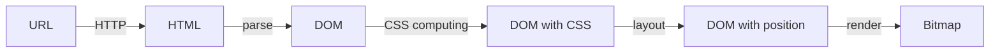

# 前端训练营-week04 丨 浏览器工作原理总论

## 预习内容

## 课件

### 录播 | 一、 浏览器总论 | 浏览器工作原理总论

#### 1. 浏览器

>浏览器是由以下5个步骤完成的整体渲染。
当我们在打开浏览器想要去浏览一个网页时，我们手敲是一个URL，而我们最后用眼睛看到的是一个图片的形式。
用计算机的术语称其为Bitmap。只有Bitmap最后传给我们的显卡驱动设备它才能转换成我们人眼可识别的光信号。
所以浏览器所有的目标是从一个 URL 到一个 Bitmap，这个过程是一个浏览器的基础的渲染流程。

首先我们是会经过一个HTTP请求和解析HTTP回应的这个过程，把这个URL里面包含的HTML给取出来。

然后我们对这个文本的HTML会进行parse。这个就是一个一般的文本分析或者说是编译的一个初级的技术。我们把HTML变成大家所熟悉的Dom树。这是一个除了HTML本身包含的信息以外，什么也没有的Dom树。

所以我们下一个步骤就是需要进行CSS computing。对这个Dom树上对应哪些CSS规则，哪些CSS规则会发生叠加或覆盖，把这个最终的结果给它计算出来的过程就是CSS computing。

计算完了之后我们就得到一个带有css属性的Dom树，也称为带样式的Dom。CSS它的全称叫做级联样式表。级联样式表是不可能待在Dom上的。为了便于理解有了 Dom with CSS 这个说法。

而有了CSS属性以后就可以开始Laylut。通过Laylut的步骤，最终将Dom树上面的所有元素产生的核的位置将它计算出来。这里获得位置的，它不是Dom元素本身，而是CSS最后生成的核。为了便于理解简化概念把它看作每个Dom里就生成一个核，所以称为DOM with position。

有了DOM with position以后就可以进行渲染，即render。通过render我们就可以把Dom树画成一个对应的图片，通过操作系统和硬件驱动提供的API接口来展示出来。

### 录播 | 二、 状态机 | 有限状态机

#### 1. 有限状态机

- 每一个状态机都是一个机器
	+ 在每一个机器里，我们可以做计算、存储、输出……
    + 所有的这些机器接受的输入是一致的
    + 状态机的每一个机器本身没有状态，如果我们用函数来表示的话，它应该是纯函数（无副作用）
- 每一个机器知道下一个状态
    + 每个机器都有确定的下一个状态（Moore）
    + 每个机器根据输入决定下一个状态（Mealy）

## 本周作业

## 本周总结

本周！请假了！
周末在加班中度过！另外上周说Markdown奇怪，所以这周用了markdownlint的插件。  
